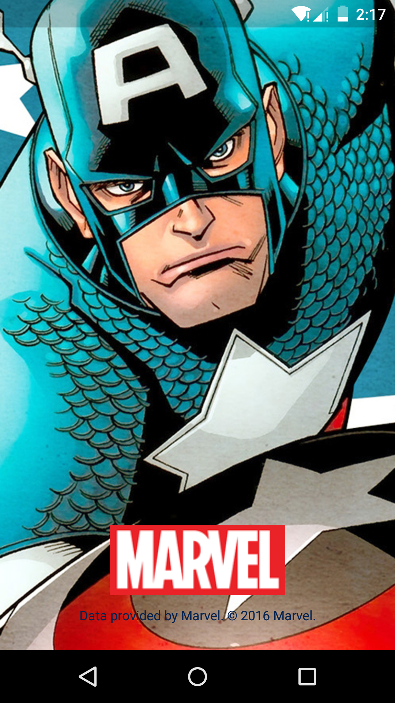
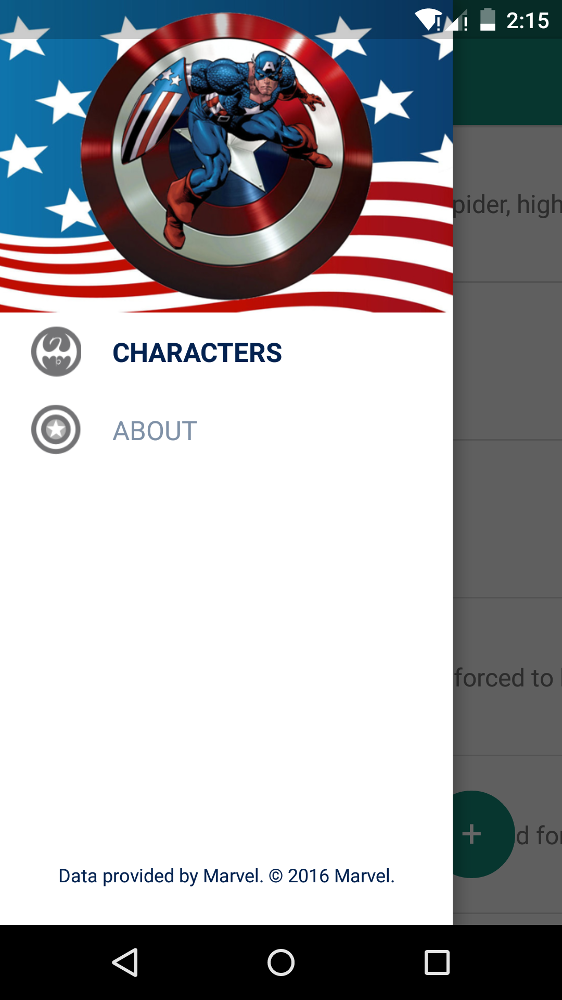
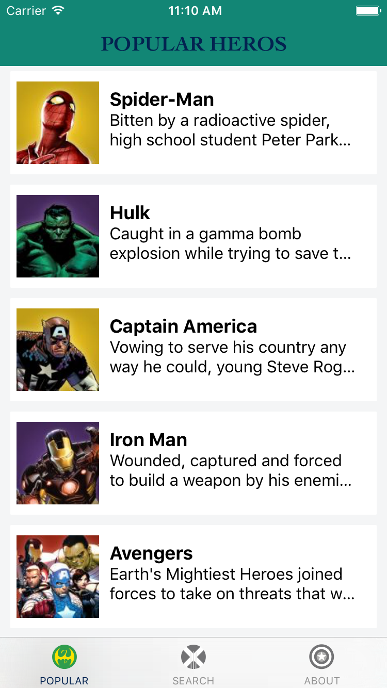
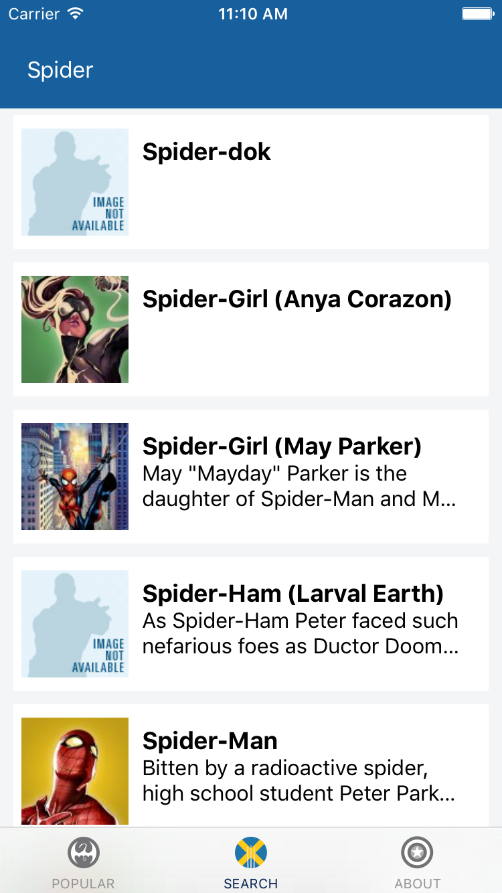
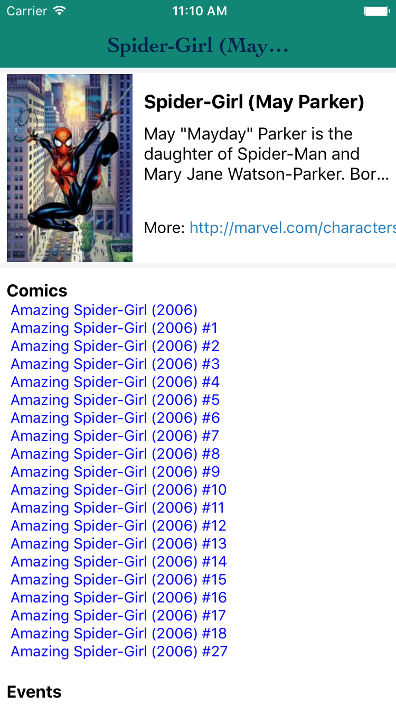

# Marvel

一个在F8基础上照猫画虎的漫威React Native App. 支持Android和IOS。
想要自己运行app的话，到http://developer.marvel.com/ 上申请API key，添加到env.js中.

# Screenshot

# Download
[APK](./apk/app-release.apk)

# Features
  - 显示流行的漫威角色
  - 搜索漫威character, event, story, series
  - IOS 支持

# Libs
  - F8 app
  - Realm
  - react-redux
  - react-native-action-button
  - react-native-hyperlink
  - crypto-js
  - redux-logger
  
